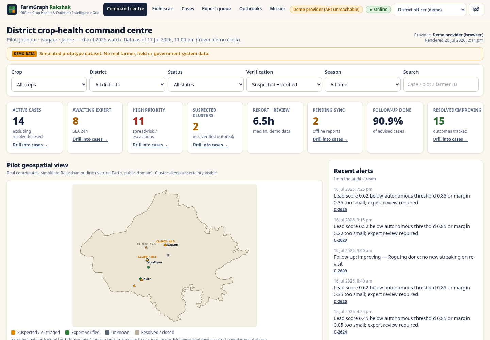
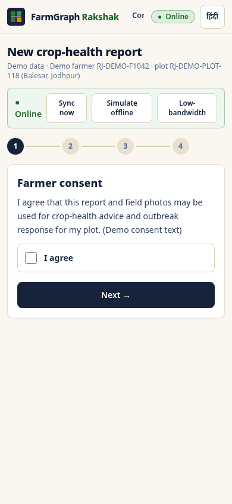
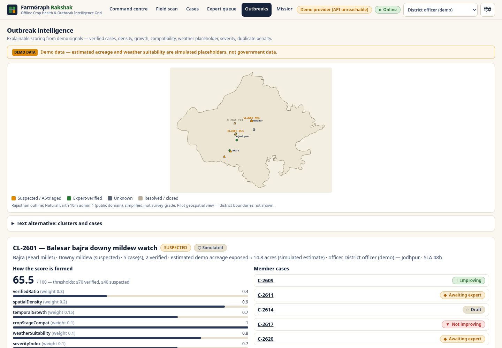
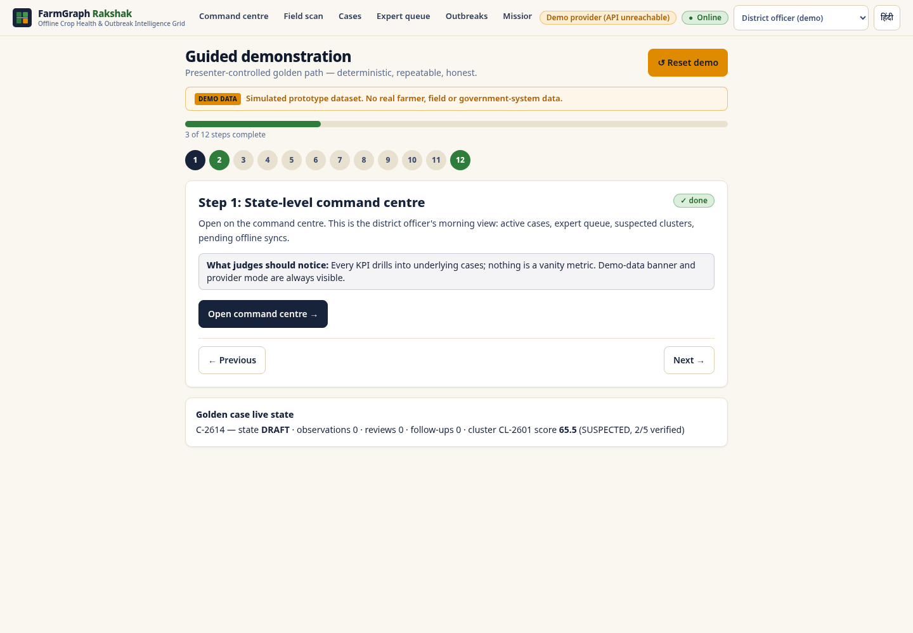

# FarmGraph Rakshak — Offline Crop Health & Outbreak Intelligence Grid for Rajasthan

[](https://github.com/Sauravssoni/RIC-FarmGraph-Sentinel/actions/workflows/ci.yml)

> **Every field seen. Every outbreak contained.**
> Task 001 prototype for the Rajasthan innovation challenge *“AI-Based Crop Disease & Pest Detection for Smallholder Farmers”* — Syntheon Technology Pvt Ltd (DPIIT DIPP213187).



## Grounded in public government research, data and infrastructure

Material design choices trace to verifiable public sources — full register in **[docs/research-evidence.md](docs/research-evidence.md)** (machine-readable: `data/reference/research-evidence.json`, also rendered in-app on `/governance`):

- **IMD station normals (Jodhpur 42339)** — 370.2 mm annual rainfall, ~63% in Jul–Aug → the outbreak weather-suitability rationale and the kharif demo calendar. ([IMD](https://mausam.imd.gov.in/jaipur/mcdata/extreme_jodhpur.pdf))
- **ICAR-AICPMIP + ICRISAT pearl-millet downy-mildew research** → the golden advisory's cultural steps (rogue & bury/burn) and the high-spread-risk escalation policy. ([AICPMIP](http://www.aicpmip.res.in/pathogolical.html), [ICRISAT](https://oar.icrisat.org/9411/1/Downy%20mildew%20of%20pearl%20millet%20and%20its%20management.pdf))
- **data.gov.in (OGD Platform, NIC)** — 100k+ datasets via free API key → the concrete, no-MoU path for AGMARKNET market context. ([data.gov.in](https://www.data.gov.in/))
- **Bhashini/ULCA (MeitY)** — published ASR/NMT/TTS pipeline APIs → the voice-adapter contract; Marwari/Mewari dialect ASR is honestly flagged as research-stage. ([API docs](https://bhashini.gitbook.io/bhashini-apis))
- **Natural Earth** public-domain boundaries → the licence-clean map. ([naturalearthdata.com](https://www.naturalearthdata.com/))

No adapter is live; every status is labelled. The rule: *if a design element can't be traced to the register, the challenge brief, or a labelled assumption, it doesn't ship.*

FarmGraph Rakshak is a **government-credible prototype** of an offline-first crop-health grid: field workers capture structured evidence on low-end Android devices, a **deterministic, explainable triage layer** (clearly labelled *simulated*) routes cases to human experts, experts confirm or correct, district officers see outbreak clusters strengthen in near-real-time, field missions verify representative farms, and only **approved, versioned advisories** ever reach a farmer — with chemical recommendations **locked by policy**.

## What this prototype proves (and what it does not)

**Proves**
- The full operational loop works end-to-end and offline-first: capture → quality gate → recapture → triage → expert review → outbreak scoring → mission → advisory → follow-up → outcome → audit.
- A non-ML, deterministic inference layer can run the entire workflow honestly while a real model is being licensed and evaluated.
- Every screen carries provenance; no number on any screen claims measured model accuracy.
- Government integration reality is represented truthfully: 17 adapters, **none live**, each with status, contract shape, consent basis and fallback.

**Does not**
- No trained ML model ships in Task 001. All confidence scores are **simulated by deterministic rules** (`data/demo/policy.json` + `taxonomy.json`) and labelled `SIMULATED`.
- No adapter is connected to any government system. Statuses are only `SIMULATED / CONTRACT_DEFINED / PUBLIC_DATA_ONLY / AWAITING_AUTHORITY / NOT_STARTED`.
- No real farmer data exists anywhere in the repo. All farmers are pseudonymous demo records.

## Quick start

```bash
# 1) install (npm workspaces — Node 20+, Python 3.12+)
npm install
python3 -m venv .venv && . .venv/bin/activate && pip install -r apps/api/requirements.txt

# 2) regenerate the deterministic demo dataset (optional — seed.json is committed)
python3 data/demo/generate_seed.py

# 3a) frontend (static demo, no backend needed)
npm run dev --workspace apps/web          # http://localhost:3000 → redirects to /command-centre

# 3b) backend API (optional; the web app auto-detects it and shows api-connected)
uvicorn app.main:app --app-dir apps/api --port 8000
NEXT_PUBLIC_API_URL=http://localhost:8000 npm run dev --workspace apps/web

# 4) guided demonstration (12 presenter steps, deterministic reset)
open http://localhost:3000/demo/
```

## Quality gates (exact commands)

```bash
npm run typecheck --workspace apps/web     # tsc --noEmit — strict
npm run lint --workspace apps/web          # eslint --max-warnings 0
npm run test --workspace apps/web          # vitest run — 26 tests
cd apps/api && python3 -m pytest tests/ -q # 18 tests
npm run build --workspace apps/web         # next build — static export to apps/web/out
npx playwright test -c tests/e2e           # golden-path e2e (system Chromium)
```

## Repository layout

```
apps/web            Next.js 15 (App Router, TS strict, Tailwind, PWA, static export)
apps/api            FastAPI + pydantic v2 — deterministic demo provider, 18 endpoints
packages/contracts  Shared TypeScript domain contracts (single type source)
data/demo           policy.json · taxonomy.json · integrations.json · generate_seed.py → seed.json
data/geo            Rajasthan outline (Natural Earth 10m, public domain) + provenance
docs                14 design/governance documents (see docs/)
infra               deployment notes & environment template
tests/e2e           Playwright golden-path + responsive checks
```

## Personas (demo switcher — not authentication)

Farmer · Field worker FW-07 · Expert (KVK persona) · District officer · State administrator. The switcher demonstrates role-appropriate views; it is **not** production authentication (that is RajSSO — adapter `AWAITING_AUTHORITY`).

## The golden demo (deterministic)

Farmer `RJ-DEMO-F1042`, plot `RJ-DEMO-PLOT-118`, Balesar (Jodhpur), bajra at vegetative stage, pale streaking. First capture **fails** the quality gate (no secondary view) → guided recapture passes → simulated triage scores **downy mildew 0.62 / nutrient stress 0.27 / unknown 0.11** → margin 0.35 < 0.40 so the case **cannot** auto-close and routes to expert → expert confirms → cluster **CL-2601 strengthens 65.5 → 71.5 and crosses SUSPECTED → VERIFIED** → representative field mission → approved advisory (chemical locked) → follow-up *improving* → outcome + audit events. `/demo` walks a presenter through all 12 steps with one-click actions and a deterministic reset.

## Environment variables

| Variable | Default | Purpose |
|---|---|---|
| `NEXT_PUBLIC_API_URL` | `http://localhost:8000` | Optional API base; web app probes `/health` and falls back to the in-browser demo provider with a visible badge. |

No secrets are required anywhere in Task 001.

## Documentation

| Doc | Contents |
|---|---|
| [docs/product-vision.md](docs/product-vision.md) | Problem framing, users, non-goals, why this wins |
| [docs/problem-research.md](docs/problem-research.md) | Grounded problem research & design implications |
| [docs/challenge-requirement-matrix.md](docs/challenge-requirement-matrix.md) | Every challenge requirement → where it is met |
| [docs/architecture.md](docs/architecture.md) | System architecture, data flow, dual-engine design |
| [docs/government-integration-matrix.md](docs/government-integration-matrix.md) | 17 adapters, statuses, contracts, fallbacks |
| [docs/offline-sync-design.md](docs/offline-sync-design.md) | Offline-first architecture and sync semantics |
| [docs/model-governance.md](docs/model-governance.md) | Model registry, abstention, thresholds, evaluation path |
| [docs/advisory-safety.md](docs/advisory-safety.md) | Advisory lifecycle and the chemical lock |
| [docs/data-provenance.md](docs/data-provenance.md) | Provenance labels, geo licensing, farmer privacy |
| [docs/research-evidence.md](docs/research-evidence.md) | Public government research/data register with citations |
| [docs/threat-model.md](docs/threat-model.md) | Security & misuse threat model |
| [docs/90-day-pilot.md](docs/90-day-pilot.md) | Phased 90-day pilot plan |
| [docs/pilot-measurement-plan.md](docs/pilot-measurement-plan.md) | Metrics, baselines, instrumentation |
| [docs/demo-script.md](docs/demo-script.md) | 12-step presenter script for judges |
| [docs/known-limitations.md](docs/known-limitations.md) | Honest limitations and Task 002 scope |

## Screenshots

| Command centre (1440px) | Field scan (390px) |
|---|---|
|  |  |
| Outbreak intelligence | Guided demo controller |
|  |  |

## Reference links (public)

- Natural Earth (public-domain geo data): https://www.naturalearthdata.com/
- NPSS — National Pest Surveillance System: https://npss.dppqs.gov.in/
- CIB&RC — Central Insecticides Board & Registration Committee: https://ppqs.gov.in/divisions/cib-rc
- AgriStack: https://agristack.gov.in/ · Raj Kisan: https://rajkisan.rajasthan.gov.in/ · Bhashini: https://bhashini.gov.in/ · IMD: https://mausam.imd.gov.in/

FarmGraph Rakshak is designed to **complement** NPSS / AgriStack / Raj Kisan — it contributes structured, expert-verified field evidence to them; it does not duplicate them.
